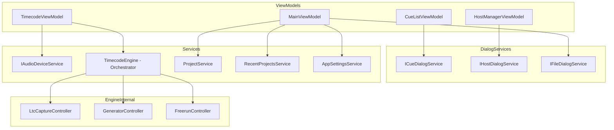

# 設計ドキュメント

## 概要

**目的**: TimecodeBridgeアプリケーションの内部コード品質・保守性・テスト容易性を向上させる。既存機能の外部動作を一切変更せず、責務の適切な分離、イベントライフサイクル管理、エラーハンドリングの改善を実現する。

**対象者**: 開発者が本リファクタリングを通じて、変更影響範囲の限定、個別テスト可能性の向上、メモリリーク潜在リスクの排除を達成する。

**影響**: TimecodeEngine、TimecodeViewModel、ProjectService、CueListViewModel、HostManagerViewModelの内部構造を変更する。公開インターフェース（ITimecodeEngine）は維持し、IProjectServiceは分割再定義する。

### ゴール
- TimecodeEngineの内部処理を論理単位ごとに独立クラスへ抽出し、オーケストレーターパターンで統合する
- TimecodeViewModelからオーディオデバイス列挙ロジックを外部サービスに委譲する
- ProjectServiceを単一責任のサービス群に分割する
- 全ViewModelにIDisposableを実装し、イベント購読のライフサイクルを管理する
- ダイアログ表示をサービスインターフェースで抽象化する
- 空キャッチブロックを具体的な例外処理+ログ出力に置き換える
- 既存テストの全通過を維持し、新規抽出クラスのユニットテストを追加する

### 非ゴール
- 外部動作・UIの変更
- 新機能の追加
- パフォーマンス最適化（計測に基づかない変更）
- フレームワーク・ライブラリのバージョンアップ
- プロジェクトファイル形式の変更

## アーキテクチャ

### 既存アーキテクチャ分析

現在のアーキテクチャはMVVMパターンに基づき、以下の構成を持つ:
- **Services層**: TimecodeEngine（530行）、ProjectService（196行）、CueManager、HostRegistry等
- **ViewModels層**: CommunityToolkit.Mvvmベース、DispatcherViewModelによるUIスレッドマーシャリング
- **DI**: Microsoft.Extensions.DependencyInjection（Singleton/Transient混在）

**維持すべきパターン**:
- Channel<TimecodeValue>ベースのフレームパイプライン
- CommunityToolkit.Mvvmのソースジェネレーター活用
- イベント駆動のコンポーネント間通信
- グレースフルデグラデーション方針

**対処すべき技術的負債**:
- TimecodeEngineへの複数関心事の集中
- ProjectServiceの関心事混在
- ViewModelのIDisposable未実装
- ダイアログのコードビハインド依存
- 空キャッチブロック（TimecodeEngine: 4箇所、ProjectService: 4箇所）

### アーキテクチャパターン & 境界マップ



**アーキテクチャ統合**:
- 選択パターン: Facadeパターン（TimecodeEngineをオーケストレーターとして維持し、内部処理を独立クラスに委譲）
- ドメイン境界: Engine内部クラスはinternalスコープで隠蔽、サービス層のみpublic
- 既存パターンの維持: ITimecodeEngineインターフェースは変更なし、Channel-basedパイプラインを維持
- 新コンポーネントの根拠: 各抽出クラスは既存の密結合ロジックを分離し、個別テストを可能にする

### 技術スタック

| レイヤー | 選択 / バージョン | 本機能での役割 | 備考 |
|---------|------------------|---------------|------|
| フレームワーク | .NET 8 / WPF | 既存維持 | 変更なし |
| MVVM | CommunityToolkit.Mvvm | ViewModel基盤 | 変更なし |
| DI | Microsoft.Extensions.DependencyInjection | サービス登録・解決 | 新サービスの登録追加 |
| オーディオ | NAudio | LTC入出力 | 変更なし |
| テスト | xUnit + Xunit.StaFact | ユニット/統合テスト | テスト追加 |

## 要件トレーサビリティ

| 要件 | 概要 | コンポーネント | インターフェース | フロー |
|------|------|---------------|-----------------|--------|
| 1.1 | デバイス列挙の外部委譲 | IAudioDeviceService | IAudioDeviceService | - |
| 1.2 | ジェネレーター状態管理の外部委譲 | GeneratorController | internal class | Engine内部フロー |
| 1.3 | LTCキャプチャ状態管理の外部委譲 | LtcCaptureController | internal class | Engine内部フロー |
| 1.4 | VMはUIバインディングのみ保持 | TimecodeViewModel | - | - |
| 1.5 | 外部動作の維持 | 全対象コンポーネント | - | 既存テスト |
| 2.1 | LTCキャプチャ処理の抽出 | LtcCaptureController | internal class | LTCパイプライン |
| 2.2 | ジェネレーター処理の抽出 | GeneratorController | internal class | ジェネレーターパイプライン |
| 2.3 | フリーラン処理の抽出 | FreerunController | internal class | フリーランフロー |
| 2.4 | Engine=オーケストレーター | TimecodeEngine | ITimecodeEngine（変更なし） | 統合フロー |
| 2.5 | タイムコード出力の維持 | TimecodeEngine | - | 既存テスト |
| 3.1 | プロジェクトI/Oのみ | ProjectService | IProjectService（縮小） | - |
| 3.2 | 最近のプロジェクト管理サービス | RecentProjectsService | IRecentProjectsService | - |
| 3.3 | アプリ設定永続化サービス | AppSettingsService | IAppSettingsService | - |
| 3.4 | ファイル形式・動作の維持 | ProjectService | - | 既存テスト |
| 4.1 | IDisposable実装 | 全ViewModel | IDisposable | - |
| 4.2 | Dispose時のイベント解除 | 全ViewModel | IDisposable | - |
| 4.3 | DIコンテナによるDispose保証 | ServiceRegistration | - | アプリ終了フロー |
| 5.1 | キュー編集ダイアログサービス | CueDialogService | ICueDialogService | - |
| 5.2 | ファイルダイアログサービス | FileDialogService | IFileDialogService | - |
| 5.3 | Func委譲の置換 | CueListViewModel, HostManagerViewModel | ICueDialogService, IHostDialogService | - |
| 5.4 | ダイアログUXの維持 | 全ダイアログサービス | - | 既存テスト |
| 6.1 | 空キャッチブロックの排除 | TimecodeEngine, ProjectService | - | - |
| 6.2 | 具体的例外型の指定 | TimecodeEngine, ProjectService | - | - |
| 6.3 | グレースフルデグラデーション維持 | 全対象コンポーネント | - | - |
| 7.1 | 既存テスト全通過 | 全対象コンポーネント | - | CI |
| 7.2 | 新規サービスのユニットテスト | テストプロジェクト | - | - |
| 7.3 | ViewModel テスト | テストプロジェクト | - | - |

## コンポーネントとインターフェース

### コンポーネントサマリー

| コンポーネント | ドメイン/レイヤー | 目的 | 要件カバレッジ | 主要依存関係 | コントラクト |
|---------------|-----------------|------|--------------|-------------|-------------|
| LtcCaptureController | Services/Engine内部 | LTCキャプチャデバイスの初期化・管理・停止 | 1.3, 2.1 | NAudio WasapiCapture (P0), LtcDecoder (P0) | Service |
| GeneratorController | Services/Engine内部 | タイムコードジェネレーターの初期化・制御・音声出力管理 | 1.2, 2.2 | TimecodeGenerator (P0), LtcEncoder (P0), NAudio WasapiOut (P1) | Service |
| FreerunController | Services/Engine内部 | 信号喪失時のフレーム自動補完 | 2.3 | なし（自己完結） | Service |
| IAudioDeviceService | Services | オーディオデバイスの列挙・キャッシュ | 1.1 | NAudio MMDeviceEnumerator (P0) | Service |
| IRecentProjectsService | Services | 最近使用したプロジェクトのMRUリスト管理 | 3.2 | IAppSettingsService (P1) | Service |
| IAppSettingsService | Services | アプリケーション設定の永続化 | 3.3 | ファイルシステム (P0) | Service, State |
| ICueDialogService | Services/Dialog | キュー編集ダイアログの表示 | 5.1, 5.3 | WPF Window (P0) | Service |
| IHostDialogService | Services/Dialog | ホスト編集ダイアログの表示 | 5.1, 5.3 | WPF Window (P0) | Service |
| IFileDialogService | Services/Dialog | ファイルダイアログの表示 | 5.2 | WPF Dialog (P0) | Service |

### Services / Engine内部

#### LtcCaptureController

| フィールド | 詳細 |
|-----------|------|
| 目的 | WasapiCapture/LtcDecoderの初期化・管理・停止を担当 |
| 要件 | 1.3, 2.1 |

**責務 & 制約**
- NAudioデバイスのライフサイクル管理（初期化、開始、停止、破棄）
- LtcDecoderへのサンプルデータ中継
- デコードされたフレームをコールバック経由で上位へ通知
- 波形表示用のオーディオサンプル抽出・通知

**依存関係**
- External: NAudio WasapiCapture / WasapiLoopbackCapture — オーディオ入力 (P0)
- External: LtcDecoder — LTCフレームデコード (P0)

**コントラクト**: Service [x]

##### サービスインターフェース
```csharp
internal class LtcCaptureController : IDisposable
{
    // フレームデコード時のコールバック
    internal Action<TimecodeValue>? OnFrameDecoded { get; set; }
    // 波形データ利用可能時のコールバック
    internal Action<float[]>? OnAudioSamplesAvailable { get; set; }

    internal void Start(string audioDeviceId, bool isLoopback, int frameRate);
    internal void Stop();
    void Dispose();
}
```
- 前提条件: audioDeviceIdは有効なMMDevice ID
- 事後条件: Start後、LTCフレーム検出時にOnFrameDecodedが呼ばれる
- 不変条件: Stop/Dispose後にコールバックは発火しない

**実装ノート**
- 統合: TimecodeEngineのStartLtc/StopLtcCaptureから抽出。既存のRecordingStopped同期パターン（ManualResetEventSlim）を維持
- 検証: audioDeviceIdの存在確認はNAudioに委譲（例外発生時はグレースフルに処理）
- リスク: NAudioデバイスの状態遷移（録音中のStop等）で例外が発生する可能性 — 具体的な例外型でキャッチしログ出力

#### GeneratorController

| フィールド | 詳細 |
|-----------|------|
| 目的 | TimecodeGenerator/LtcEncoder/WasapiOutの初期化・制御 |
| 要件 | 1.2, 2.2 |

**責務 & 制約**
- ジェネレーターの開始・一時停止・再開・リセット・破棄
- LTCエンコーダーへのフレーム供給
- 音声出力デバイスの初期化・管理（オプション、グレースフルデグラデーション）

**依存関係**
- External: TimecodeGenerator — フレーム生成 (P0)
- External: LtcEncoder — LTCエンコード (P0)
- External: NAudio WasapiOut — 音声出力 (P1、オプション)

**コントラクト**: Service [x]

##### サービスインターフェース
```csharp
internal class GeneratorController : IDisposable
{
    internal Action<TimecodeValue>? OnFrameGenerated { get; set; }

    internal void Start(GeneratorSettings settings);
    internal void Resume();
    internal void Pause();
    internal void Reset();
    void Dispose();
}
```
- 前提条件: settingsは有効なGeneratorSettings
- 事後条件: Start後、フレーム生成ごとにOnFrameGeneratedが呼ばれる
- 不変条件: 音声出力デバイスが利用不可でもフレーム生成は継続する

**実装ノート**
- 統合: TimecodeEngineのStartGenerator/ResumeGenerator/StopGenerator/ResetGenerator/DisposeGeneratorから抽出
- 検証: OutputDeviceIdが空の場合、音声出力なしで動作
- リスク: WasapiOutのPlay/Pause/Stop時の例外 — COMException等を具体的にキャッチ

#### FreerunController

| フィールド | 詳細 |
|-----------|------|
| 目的 | 信号喪失時のタイムコードフレーム自動補完 |
| 要件 | 2.3 |

**責務 & 制約**
- 最終受信フレームからの連続フレーム生成
- フレームレートに合わせた精密タイミング制御（Stopwatchベース）
- 指定時間経過後の自動停止

**依存関係**
- なし（自己完結型、フレームレートとTimecodeValue演算のみ使用）

**コントラクト**: Service [x]

##### サービスインターフェース
```csharp
internal class FreerunController : IDisposable
{
    internal Action<TimecodeValue, TimecodeValue>? OnFrameGenerated { get; set; }
    internal bool IsFreerunning { get; }

    internal void Start(TimecodeValue lastRawFrame, TimecodeOffset offset, FrameRate frameRate, double durationSeconds);
    internal void Stop();
    void Dispose();
}
```
- 前提条件: lastRawFrameは最後に受信した有効なフレーム
- 事後条件: Start後、フレームレートに合わせてOnFrameGeneratedが呼ばれる。durationSeconds経過後に自動停止
- 不変条件: Stop/Dispose後にスレッドは終了する

**実装ノート**
- 統合: TimecodeEngineのStartFreerun/StopFreerunから抽出。専用スレッド+CancellationTokenパターンを維持
- リスク: スレッド終了タイミングの競合 — CancellationTokenSourceの適切なDisposeを保証

### Services

#### IAudioDeviceService

| フィールド | 詳細 |
|-----------|------|
| 目的 | オーディオ入出力デバイスの列挙 |
| 要件 | 1.1 |

**責務 & 制約**
- キャプチャデバイス（入力）とレンダーデバイス（出力/ループバック）の列挙
- AudioDeviceInfoリストの提供

**依存関係**
- External: NAudio MMDeviceEnumerator — デバイス列挙 (P0)

**コントラクト**: Service [x]

##### サービスインターフェース
```csharp
public interface IAudioDeviceService
{
    IReadOnlyList<AudioDeviceInfo> GetCaptureDevices();
    IReadOnlyList<AudioDeviceInfo> GetRenderDevices();
}
```
- 前提条件: なし
- 事後条件: 現在アクティブなデバイスのリストを返す。デバイスが存在しない場合は空リスト
- 不変条件: 呼び出しごとに最新のデバイス情報を取得する

**実装ノート**
- 統合: TimecodeViewModel.RefreshAudioDevicesから抽出。ループバック用のデバイス名加工（" (Loopback)"付加）もサービス内で処理
- 検証: MMDeviceEnumeratorの例外（COMException等）をキャッチしログ出力、空リスト返却

#### IRecentProjectsService

| フィールド | 詳細 |
|-----------|------|
| 目的 | 最近使用したプロジェクトのMRUリスト管理 |
| 要件 | 3.2 |

**責務 & 制約**
- MRUリストの管理（最大10件）
- IAppSettingsServiceを経由した永続化

**依存関係**
- Inbound: MainViewModel — MRUリスト取得・更新 (P0)
- Outbound: IAppSettingsService — 永続化 (P1)

**コントラクト**: Service [x]

##### サービスインターフェース
```csharp
public interface IRecentProjectsService
{
    IReadOnlyList<string> GetRecentProjects();
    void AddRecentProject(string filePath);
}
```
- 前提条件: filePathは有効なファイルパス
- 事後条件: 追加後、リストの先頭にfilePathが存在する。リストは最大10件
- 不変条件: リストの順序は最新使用順

**実装ノート**
- 統合: ProjectServiceのAddToRecentProjects/GetRecentProjectsから抽出
- 検証: 永続化失敗時はメモリ内リストを維持（ベストエフォート）

#### IAppSettingsService

| フィールド | 詳細 |
|-----------|------|
| 目的 | アプリケーション設定の永続化（背景設定、MRUリスト等） |
| 要件 | 3.3 |

**責務 & 制約**
- settings.jsonファイルへの読み書き
- 設定項目の型安全なアクセス
- ファイルI/Oエラーのグレースフルハンドリング

**依存関係**
- External: ファイルシステム — JSON永続化 (P0)

**コントラクト**: Service [x] / State [x]

##### サービスインターフェース
```csharp
public interface IAppSettingsService
{
    BackgroundSettings LoadBackgroundSettings();
    void SaveBackgroundSettings(BackgroundSettings settings);
    List<string> LoadRecentProjects();
    void SaveRecentProjects(List<string> projects);
}
```
- 前提条件: なし
- 事後条件: Load系メソッドは読み込み失敗時にデフォルト値を返す。Save系メソッドは失敗時に例外をスローせずログ出力
- 不変条件: 同一ファイルへの読み書きはスレッドセーフではない（単一スレッドからの呼び出しを前提）

##### 状態管理
- 状態モデル: AppSettings（RecentProjects + BackgroundSettings）をJSONとして管理
- 永続化: %APPDATA%/TimecodeBridge/settings.json
- 整合性: ファイル破損時はデフォルト値にフォールバック

**実装ノート**
- 統合: ProjectServiceのLoadRecentProjectsFromDisk/SaveRecentProjectsToDisk/LoadBackgroundSettings/SaveBackgroundSettingsから抽出
- リスク: 複数サービスが同一JSONファイルを操作する競合 — 単一のIAppSettingsServiceに集約して排他制御

### Services / Dialog

#### ICueDialogService

| フィールド | 詳細 |
|-----------|------|
| 目的 | キュー編集・バッチ複製ダイアログの表示 |
| 要件 | 5.1, 5.3 |

**責務 & 制約**
- キュー編集ダイアログの表示と結果の返却
- バッチ複製ダイアログの表示と結果の返却
- WPFウィンドウの所有者設定

**依存関係**
- External: WPF Window — ダイアログ表示 (P0)

**コントラクト**: Service [x]

##### サービスインターフェース
```csharp
public interface ICueDialogService
{
    Cue? ShowEditDialog(Cue template, IReadOnlyList<OscHost> hosts, FrameRate frameRate, string title);
    (int Count, double IntervalHours)? ShowBatchDuplicateDialog();
}
```
- 前提条件: UIスレッドから呼び出す
- 事後条件: ユーザーがOKした場合は結果を返却、キャンセル時はnullを返却
- 不変条件: ダイアログはモーダルで表示される

**実装ノート**
- 統合: CueListViewModelのDefaultShowCueEditDialog/BatchDuplicateCueから抽出
- 検証: Application.Current?.MainWindowの存在確認を維持

#### IHostDialogService

| フィールド | 詳細 |
|-----------|------|
| 目的 | ホスト編集ダイアログの表示 |
| 要件 | 5.1, 5.3 |

**責務 & 制約**
- ホスト編集ダイアログの表示と結果の返却

**依存関係**
- External: WPF Window — ダイアログ表示 (P0)

**コントラクト**: Service [x]

##### サービスインターフェース
```csharp
public interface IHostDialogService
{
    OscHost? ShowEditDialog(OscHost template);
}
```
- 前提条件: UIスレッドから呼び出す
- 事後条件: ユーザーがOKした場合は編集結果を返却、キャンセル時はnullを返却

**実装ノート**
- 統合: HostManagerViewModelのDefaultShowHostEditDialogから抽出

#### IFileDialogService

| フィールド | 詳細 |
|-----------|------|
| 目的 | ファイルダイアログ（開く・保存）の表示 |
| 要件 | 5.2 |

**責務 & 制約**
- ファイルを開くダイアログの表示とパス返却
- ファイルを保存するダイアログの表示とパス返却

**依存関係**
- External: WPF OpenFileDialog / SaveFileDialog (P0)

**コントラクト**: Service [x]

##### サービスインターフェース
```csharp
public interface IFileDialogService
{
    string? ShowOpenFileDialog(string filter, string? initialDirectory = null);
    string? ShowSaveFileDialog(string filter, string? defaultFileName = null, string? initialDirectory = null);
}
```
- 前提条件: UIスレッドから呼び出す
- 事後条件: ユーザーがファイルを選択した場合はフルパスを返却、キャンセル時はnullを返却

**実装ノート**
- 統合: MainWindow.xaml.csのコードビハインドからファイルダイアログ処理を抽出
- テスト時はモックで差し替え可能

## エラーハンドリング

### エラー戦略

本リファクタリングでは、既存の「グレースフルデグラデーション」方針を維持しつつ、問題の可視性を向上させる。

### エラーカテゴリと対応

**デバイスエラー**（TimecodeEngine内部）:
- NAudio COMException → ログ出力+機能低下で継続
- デバイス切断 → ログ出力+NotReceiving状態へ遷移

**設定ファイルエラー**（AppSettingsService）:
- FileNotFoundException → デフォルト値で継続
- JsonException → ログ出力+デフォルト値で継続
- IOException → ログ出力+操作スキップ

**ダイアログエラー**（DialogService）:
- InvalidOperationException（UIスレッド外からの呼び出し） → 例外をスロー（プログラムエラー）

### モニタリング

- 全エラーをILogger（またはTrace/Debug）経由で記録
- 空キャッチブロックの排除: `catch { }` → `catch (具体的例外型 ex) { Logger.LogWarning(ex, "context"); }`
- リリースビルドでもログが有効になるよう、Debug.WriteLineからTrace.WriteLineまたはILogger使用に移行を検討（Requirement 6の範囲内で最小限の対応）

## テスト戦略

### ユニットテスト
- **LtcCaptureController**: Start/Stopのライフサイクル、コールバック発火の検証
- **GeneratorController**: Start/Resume/Pause/Resetの状態遷移、グレースフルデグラデーション（出力デバイスなし）
- **FreerunController**: フレーム生成の開始・停止、自動期限切れ
- **AudioDeviceService**: デバイス列挙（NAudioモック経由）
- **RecentProjectsService**: MRUリスト操作（追加、上限、永続化）
- **AppSettingsService**: 設定の読み書き、ファイル破損時のフォールバック
- **ICueDialogService/IHostDialogService/IFileDialogService**: モック実装によるViewModel統合テスト

### 統合テスト
- 既存の統合テスト（CueTriggerFlowTests, RelayFlowTests, ProjectPersistenceTests, GeneratorIntegrationTests）が全て通過すること
- ProjectService分割後のプロジェクト保存・読み込みラウンドトリップテスト

### 回帰テスト
- 既存の全テスト（約6,300行、25ファイル）が変更なく通過すること
- InternalsVisibleTo追加後、Engine内部クラスのテストが追加可能であること
