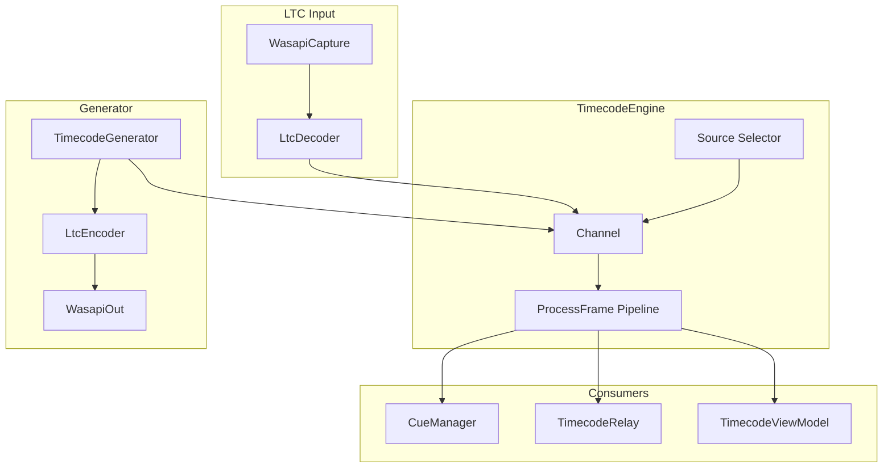
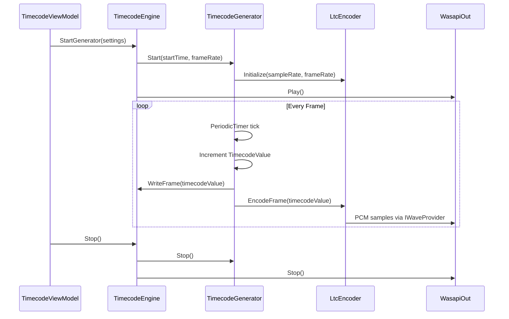
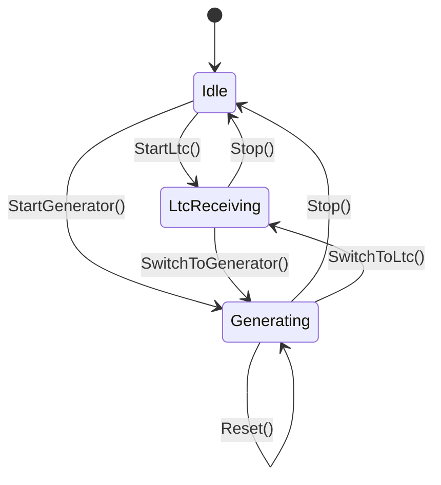

# Design Document: timecode-generation

## Overview

**Purpose**: タイムコードジェネレーター機能は、TimecodeBridgeが外部ソースに依存せず内部でタイムコードを生成し、既存のキュートリガー・OSCリレー機能と連携させる。さらに、生成タイムコードをLTCオーディオ信号として外部機器に供給する。

**Users**: ライブイベント・映像制作・舞台演出のオペレーターが、マスタークロックとしてTimecodeBridgeを使用するワークフローで利用する。

**Impact**: 既存TimecodeEngineにジェネレーターモードを追加し、TimecodeSourceType enumを拡張する。CueManager・TimecodeRelayへの変更は不要（ITimecodeEngineイベント経由で自動連携）。

### Goals
- 内部クロックによるフレーム精度のタイムコード生成
- LTC受信モードとジェネレーターモードのシームレスな切り替え
- LTCオーディオ信号出力による外部機器へのタイムコード供給
- 生成設定のプロジェクトファイル永続化

### Non-Goals
- MTC（MIDI Timecode）生成（将来対応）
- 外部タイムコードへのスレーブ同期（ジャム同期）
- 複数ジェネレーターインスタンスの同時実行
- ジェネレーターのネットワーク経由リモート制御

## Architecture

### Existing Architecture Analysis

現行システムはLTC受信専用のパイプラインで構成：

```
WasapiCapture → LtcDecoder → Channel<TimecodeValue> → TimecodeEngine.ProcessFrame
                                                          ↓
                                                    TimecodeUpdated event
                                                    ↓              ↓
                                              CueManager    TimecodeRelay
```

**拡張ポイント**:
- `TimecodeSourceType` enumに`Generator`を追加
- `TimecodeEngine`に`StartGenerator()`メソッドを追加
- `ProcessFrame()`パイプラインはソース非依存のため再利用可能
- `Channel<TimecodeValue>`にジェネレーターからフレームを注入

### Architecture Pattern & Boundary Map



**Architecture Integration**:
- Selected pattern: 既存TimecodeEngine拡張（ソース抽象化パターン）
- Domain boundaries: ジェネレーター固有ロジック（タイマー、LTCエンコード）は専用クラスに委譲し、TimecodeEngineはオーケストレーションのみ
- Existing patterns preserved: Channel-based frame processing, event-driven consumer notification, lock-based thread safety
- New components rationale: TimecodeGenerator（フレーム生成責務）、LtcEncoder（LTCオーディオ変換責務）
- Steering compliance: 既存MVVM + Serviceレイヤーパターンを維持

### Technology Stack

| Layer | Choice / Version | Role in Feature | Notes |
|-------|------------------|-----------------|-------|
| Services | .NET 8 / C# | TimecodeGenerator, LtcEncoder | 既存スタック |
| Audio Output | NAudio 2.2.1 | WasapiOut + IWaveProvider | 既存依存、追加ライブラリ不要 |
| Timing | System.Threading.PeriodicTimer + Stopwatch | フレーム精度タイマー | .NET 8標準 |
| UI | WPF / CommunityToolkit.Mvvm 8.4.0 | ジェネレーター制御UI | 既存スタック |
| Serialization | System.Text.Json | 生成設定永続化 | 既存ProjectData拡張 |

## System Flows

### タイムコード生成フロー



### ソース切り替えフロー



ソース切り替え時は現在のソースをStop()してから新しいソースをStart()する。Reset()はジェネレーター動作中に開始時間へ巻き戻す。

## Requirements Traceability

| Requirement | Summary | Components | Interfaces | Flows |
|-------------|---------|------------|------------|-------|
| 1.1 | フレーム精度タイムコード生成 | TimecodeGenerator | ITimecodeGenerator | 生成フロー |
| 1.2 | フレームレート選択 | TimecodeGenerator | GeneratorSettings | - |
| 1.3 | 開始時間設定 | TimecodeGenerator | GeneratorSettings | - |
| 1.4 | カウントアップ動作 | TimecodeGenerator | ITimecodeGenerator.Start | 生成フロー |
| 1.5 | 開始・停止・リセット | TimecodeGenerator, TimecodeEngine | ITimecodeGenerator, ITimecodeEngine | ソース切り替えフロー |
| 1.6 | リセット動作 | TimecodeGenerator | ITimecodeGenerator.Reset | ソース切り替えフロー |
| 1.7 | UI表示 | TimecodeViewModel | - | - |
| 1.8 | 既存機能連携 | TimecodeEngine | ITimecodeEngine | 生成フロー |
| 2.1 | ソース選択UI | TimecodeViewModel | - | ソース切り替えフロー |
| 2.2 | ソース切り替え反映 | TimecodeEngine | ITimecodeEngine | ソース切り替えフロー |
| 2.3 | 入力UI無効化 | TimecodeViewModel | - | - |
| 2.4 | 生成UI無効化 | TimecodeViewModel | - | - |
| 2.5 | ソース表示 | TimecodeViewModel | - | - |
| 3.1 | LTCエンコード | LtcEncoder | ILtcEncoder | 生成フロー |
| 3.2 | 出力デバイス選択 | TimecodeViewModel, TimecodeEngine | - | - |
| 3.3 | 音量調整 | LtcEncoder | ILtcEncoder | - |
| 3.4 | LTC出力開始 | TimecodeEngine | ITimecodeEngine | 生成フロー |
| 3.5 | LTC出力停止 | TimecodeEngine | ITimecodeEngine | 生成フロー |
| 3.6 | 出力状態表示 | TimecodeViewModel | - | - |
| 4.1 | 設定保存 | ProjectData | GeneratorSettings | - |
| 4.2 | 設定復元 | ProjectService | - | - |
| 4.3 | ソース選択保存 | ProjectData | TimecodeSourceSettings | - |

## Components and Interfaces

| Component | Domain/Layer | Intent | Req Coverage | Key Dependencies | Contracts |
|-----------|--------------|--------|--------------|-----------------|-----------|
| TimecodeGenerator | Services | フレーム精度のタイムコード値生成 | 1.1-1.6 | TimecodeEngine (P0) | Service, State |
| LtcEncoder | Services | TimecodeValueからLTCオーディオサンプル生成 | 3.1, 3.3 | TimecodeGenerator (P0), NAudio (P0) | Service |
| TimecodeEngine拡張 | Services | ジェネレーターモードのオーケストレーション | 1.5, 1.8, 2.2, 3.4, 3.5 | TimecodeGenerator (P0), LtcEncoder (P1) | Service, Event |
| TimecodeViewModel拡張 | ViewModels | ジェネレーター制御・ソース切り替えUI | 1.7, 2.1, 2.3-2.5, 3.2, 3.6 | TimecodeEngine (P0) | State |
| GeneratorSettings | Models | 生成設定データモデル | 4.1-4.3 | - | - |

### Services

#### TimecodeGenerator

| Field | Detail |
|-------|--------|
| Intent | PeriodicTimerベースでフレーム精度のタイムコード値を生成する |
| Requirements | 1.1, 1.2, 1.3, 1.4, 1.5, 1.6 |

**Responsibilities & Constraints**
- フレームレートに同期したタイムコードのカウントアップ
- 開始時間からのフレーム単位インクリメント
- ドロップフレーム計算（29.97fps時）はTimecodeValue.FromTotalFramesに委譲
- Stopwatchによる累積ドリフト補正

**Dependencies**
- Outbound: TimecodeEngine — フレーム注入 (P0)
- External: System.Threading.PeriodicTimer — タイミング制御 (P0)

**Contracts**: Service [x] / State [x]

##### Service Interface
```csharp
public interface ITimecodeGenerator
{
    TimecodeValue CurrentTimecode { get; }
    bool IsRunning { get; }

    void Start(TimecodeValue startTime, FrameRate frameRate);
    void Stop();
    void Reset();

    event EventHandler<TimecodeValue> FrameGenerated;
}
```
- Preconditions: Start()はIsRunning == falseの時のみ呼び出し可能
- Postconditions: Start()後、FrameGeneratedイベントがフレームレート間隔で発火
- Invariants: CurrentTimecodeは常に有効なTimecodeValue（23:59:59:FF以内）

##### State Management
- State model: `Idle` → `Running` → `Idle`（Stop/Reset）
- Persistence: 状態自体は永続化しない（設定のみ永続化）
- Concurrency: PeriodicTimerのasyncループ内で単一スレッド動作。CurrentTimecodeはvolatile読み取りまたはlock保護

#### LtcEncoder

| Field | Detail |
|-------|--------|
| Intent | TimecodeValueをSMPTE LTCフレーム（80ビット）にエンコードし、BMC変調されたPCMサンプルを生成する |
| Requirements | 3.1, 3.3 |

**Responsibilities & Constraints**
- TimecodeValue → 80ビットLTCフレーム変換（BCD + sync word）
- Biphase Mark Codingによるオーディオサンプル生成
- 音量レベル（振幅スケーリング）の適用
- IWaveProvider実装によるNAudio出力パイプラインとの統合

**Dependencies**
- Inbound: TimecodeGenerator — エンコード対象フレーム (P0)
- External: NAudio 2.2.1 — IWaveProvider, WaveFormat (P0)

**Contracts**: Service [x]

##### Service Interface
```csharp
public interface ILtcEncoder : IWaveProvider
{
    float VolumeLevel { get; set; }

    void Initialize(int sampleRate, FrameRate frameRate);
    void EnqueueFrame(TimecodeValue frame);
    void Reset();
}
```
- IWaveProvider.Read()はNAudioから呼び出され、バッファにLTCサンプルを書き込む
- Preconditions: Initialize()がRead()より前に呼ばれること
- Postconditions: EnqueueFrame()後、次のRead()呼び出しで該当フレームのサンプルが返される
- Invariants: VolumeLevelは0.0f〜1.0fの範囲

**Implementation Notes**
- Integration: LtcDecoderと同一のビット配置仕様を使用（bits 0-3: frame units等）
- Validation: フレーム値の範囲チェックはTimecodeValue側の責務
- Risks: サンプルバッファのアンダーラン時はサイレンス（ゼロサンプル）を出力

#### TimecodeEngine拡張

| Field | Detail |
|-------|--------|
| Intent | ジェネレーターモードの開始・停止・ソース切り替えのオーケストレーション |
| Requirements | 1.5, 1.8, 2.2, 3.4, 3.5 |

**拡張内容**

ITimecodeEngineインターフェースへの追加：
```csharp
// 既存インターフェースへの追加メソッド
void StartGenerator(GeneratorSettings settings);
void ResetGenerator();
```

TimecodeSourceType enumへの追加：
```csharp
public enum TimecodeSourceType
{
    Ltc,
    Generator,  // 追加
}
```

**Dependencies**
- Outbound: TimecodeGenerator — 生成制御 (P0)
- Outbound: LtcEncoder — オーディオ出力パイプライン (P1)
- External: NAudio WasapiOut — オーディオデバイス出力 (P0)

**Contracts**: Service [x] / Event [x]

##### Event Contract
- Published events: 既存の`TimecodeUpdated`、`StatusChanged`をジェネレーターモードでも発火（変更なし）
- Ordering: フレーム順序保証（Channel経由のFIFO）

**Implementation Notes**
- Integration: StartGenerator()はStop()を内部で呼び出してから、TimecodeGeneratorとLtcEncoder/WasapiOutを初期化
- Validation: StartGenerator()呼び出し時にGeneratorSettingsの妥当性検証
- Risks: オーディオ出力デバイスが利用不可の場合、LTC出力なしでジェネレーターのみ動作させる（graceful degradation）

### ViewModels

#### TimecodeViewModel拡張

| Field | Detail |
|-------|--------|
| Intent | ジェネレーター制御UI、ソース切り替え、出力デバイス選択のバインディング提供 |
| Requirements | 1.7, 2.1, 2.3, 2.4, 2.5, 3.2, 3.6 |

**追加プロパティ・コマンド**（CommunityToolkit.Mvvm属性）:
```csharp
// ObservableProperties
TimecodeSourceType SelectedSource          // 2.1, 2.5
bool IsGeneratorMode                       // 2.3, 2.4（計算プロパティ）
bool IsGeneratorRunning                    // 1.7, 3.6
string GeneratorStartTime                  // 1.3
FrameRate GeneratorFrameRate               // 1.2
string SelectedOutputDeviceId              // 3.2
float OutputVolumeLevel                    // 3.3
ObservableCollection<AudioDeviceInfo> OutputDevices  // 3.2

// RelayCommands
StartGeneratorCommand                      // 1.5
StopGeneratorCommand                       // 1.5
ResetGeneratorCommand                      // 1.6
```

**Implementation Notes**
- IsGeneratorModeはSelectedSourceの変更に連動する計算プロパティ。CanExecute制御に使用
- 既存のオーディオ入力デバイス列挙ロジック（MMDeviceEnumerator）をDataFlow.Render用に拡張

## Data Models

### Domain Model

#### GeneratorSettings

```csharp
public class GeneratorSettings
{
    public FrameRate FrameRate { get; set; } = FrameRate.Fps30;
    public TimecodeValue StartTime { get; set; } = new(0, 0, 0, 0, FrameRate.Fps30);
    public string OutputDeviceId { get; set; } = string.Empty;
    public float VolumeLevel { get; set; } = 0.8f;
}
```

#### TimecodeSourceSettings拡張

```csharp
public class TimecodeSourceSettings
{
    public TimecodeSourceType SourceType { get; set; } = TimecodeSourceType.Ltc;
    public string DeviceId { get; set; } = string.Empty;
    public GeneratorSettings GeneratorSettings { get; set; } = new();  // 追加
}
```

#### ProjectData拡張

既存`TimecodeSourceSettings`プロパティ経由で自動的にGeneratorSettingsが永続化される。ProjectDataへの直接変更は不要。

### Logical Data Model

ProjectDataのJSON永続化にGeneratorSettingsが追加される：

```json
{
  "sourceSettings": {
    "sourceType": "Generator",
    "deviceId": "",
    "generatorSettings": {
      "frameRate": "Fps30",
      "startTime": { "hours": 1, "minutes": 0, "seconds": 0, "frames": 0, "frameRate": "Fps30" },
      "outputDeviceId": "device-guid",
      "volumeLevel": 0.8
    }
  }
}
```

既存の`JsonSerializerOptions`（camelCase、WriteIndented）がそのまま適用される。TimecodeValueのシリアライズはrecord structの自動シリアライズまたはカスタムコンバーターで対応。

## Error Handling

### Error Strategy
既存TimecodeEngineのパターンを踏襲：例外はキャッチしてStatusChangedイベントで通知。

### Error Categories and Responses
- **オーディオデバイス不可**: 出力デバイスが見つからない/使用中 → LTC出力なしでジェネレーターのみ動作、UIに警告表示
- **デバイス切断**: 出力中にデバイスが切断 → LTC出力を停止しStatusChanged発火、ジェネレーターは継続
- **不正な設定値**: 開始時間がフレームレートの範囲外 → TimecodeValue側のバリデーションで防止

## Testing Strategy

### Unit Tests
- TimecodeGenerator: フレームレート毎のカウントアップ精度（1秒分のフレーム数検証）
- TimecodeGenerator: リセット後の開始時間復帰
- TimecodeGenerator: ドロップフレーム（29.97fps）の正確な生成
- LtcEncoder: TimecodeValueからの80ビットフレーム構築（既知値との比較）
- LtcEncoder: BMCエンコード波形の正確性（LtcDecoderでデコードして往復検証）

### Integration Tests
- TimecodeEngine: StartGenerator → TimecodeUpdatedイベント発火の検証
- TimecodeEngine: LTC受信→ジェネレーター切り替え時のイベント連続性
- LtcEncoder → LtcDecoder ラウンドトリップ: エンコードしたサンプルをデコードして元のTimecodeValueと一致
- ProjectData: GeneratorSettings含むシリアライズ/デシリアライズの往復検証

### Performance
- ジェネレーターのフレーム間隔精度: 1000フレーム生成時の累積ドリフトが1フレーム未満
- LtcEncoderのRead()レイテンシ: WasapiOutコールバック内で完了（バッファアンダーランなし）
