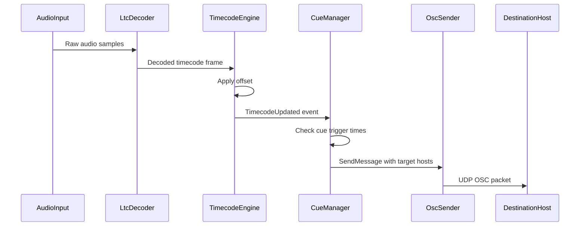
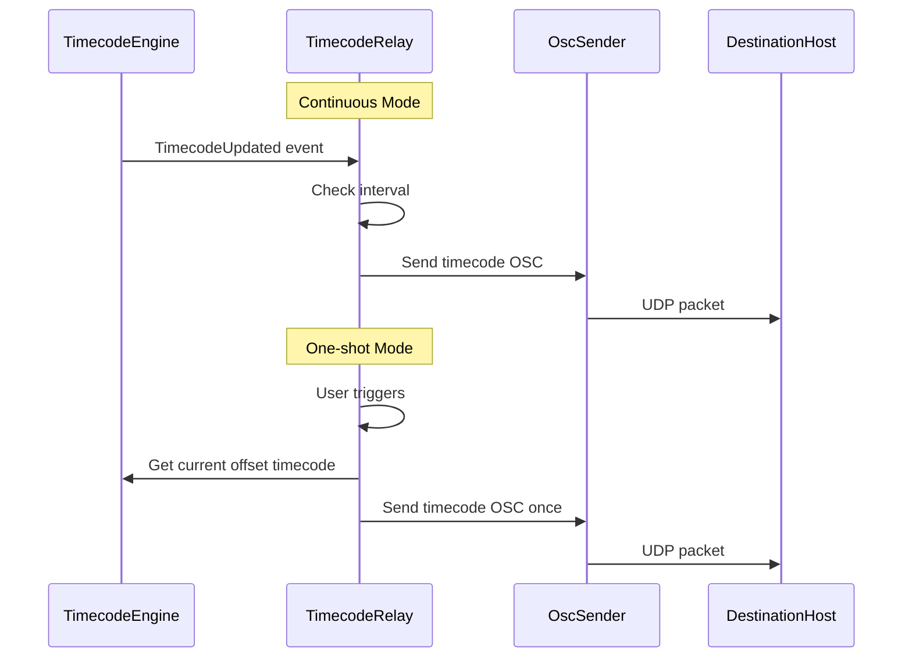
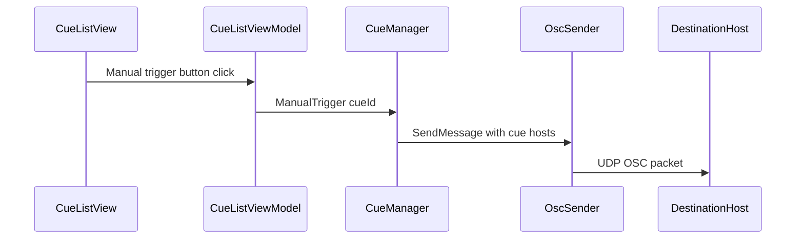
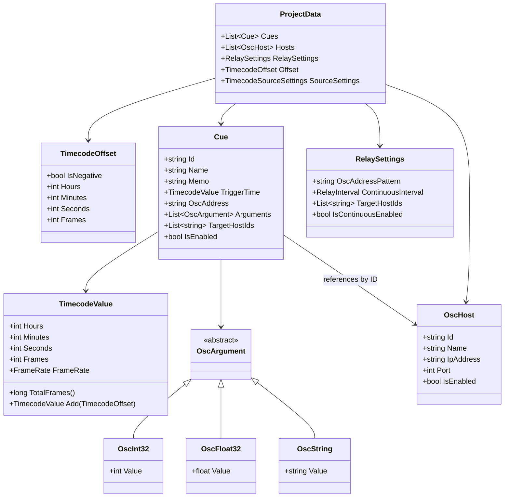

# Design Document — timecode-osc-bridge

## Overview

**Purpose**: TimecodeBridge は、外部ソースから受信した Timecode（LTC/MTC）を解析し、オフセット適用・キューベースの OSC メッセージ送信・リアルタイム Timecode リレーを提供する Windows デスクトップアプリケーションである。

**Users**: ライブイベント・映像制作・舞台演出のオペレーターが、時間同期に基づく機器制御ワークフローで使用する。

### Goals
- LTC/MTC 両方式の Timecode を受信・解析し、オフセット付きで表示
- 時間ベースのキュートリガーおよび手動トリガーで OSC メッセージを送信先ホストへ送信
- 受信 Timecode をリアルタイムまたはワンショットで OSC リレー
- ライブ現場で信頼性の高いダークテーマ UI を提供

### Non-Goals
- Timecode のエンコード・生成（受信のみ）
- OSC メッセージの受信（送信のみ）
- クロスプラットフォーム対応（Windows 専用）
- 映像・オーディオの再生制御

## Architecture

### Architecture Pattern & Boundary Map

MVVM + Service Layer アーキテクチャを採用する。Timecode 更新はイベント駆動で通知し、UI 層は ViewModel を介してバインドする。

```mermaid
graph TB
    subgraph UI Layer
        MainWindow[MainWindow]
        TimecodeDisplay[TimecodeDisplayView]
        CueListView[CueListView]
        HostManagerView[HostManagerView]
        RelayControlView[RelayControlView]
        LogView[LogView]
    end

    subgraph ViewModel Layer
        MainVM[MainViewModel]
        TimecodeVM[TimecodeViewModel]
        CueListVM[CueListViewModel]
        HostVM[HostManagerViewModel]
        RelayVM[RelayViewModel]
        LogVM[LogViewModel]
    end

    subgraph Service Layer
        TimecodeEngine[TimecodeEngine]
        CueManager[CueManager]
        OscSender[OscSender]
        TimecodeRelay[TimecodeRelay]
        HostRegistry[HostRegistry]
        ProjectService[ProjectService]
    end

    subgraph Infrastructure
        NAudioCapture[NAudio AudioCapture]
        NAudioMidi[NAudio MidiIn]
        LibLtc[libltc Native]
        OscCore[OscCore UDP]
        FileSystem[FileSystem JSON]
    end

    MainWindow --> MainVM
    TimecodeDisplay --> TimecodeVM
    CueListView --> CueListVM
    HostManagerView --> HostVM
    RelayControlView --> RelayVM
    LogView --> LogVM

    TimecodeVM --> TimecodeEngine
    CueListVM --> CueManager
    CueListVM --> OscSender
    HostVM --> HostRegistry
    RelayVM --> TimecodeRelay
    LogVM --> OscSender

    TimecodeEngine --> NAudioCapture
    TimecodeEngine --> NAudioMidi
    TimecodeEngine --> LibLtc
    CueManager --> TimecodeEngine
    CueManager --> OscSender
    TimecodeRelay --> TimecodeEngine
    TimecodeRelay --> OscSender
    OscSender --> OscCore
    OscSender --> HostRegistry
    ProjectService --> FileSystem
end
```

**Architecture Integration**:
- **Selected pattern**: MVVM + Service Layer — WPF との自然な統合、適度な疎結合
- **Domain boundaries**: UI 層は ViewModel 経由でのみ Service 層にアクセス。Service 層はインフラストラクチャを直接参照
- **New components rationale**: 全コンポーネントが新規。TimecodeEngine がドメインの中核で、CueManager と TimecodeRelay がそれに依存
- **Event flow**: TimecodeEngine → C# event で TimecodeUpdated を発行 → CueManager / TimecodeRelay / TimecodeViewModel が購読

### Technology Stack

| Layer | Choice / Version | Role in Feature | Notes |
|-------|------------------|-----------------|-------|
| Runtime | .NET 8 (LTS) | アプリケーション実行環境 | Windows x64 |
| UI Framework | WPF | MVVM ベースの UI | ダークテーマはカスタム ResourceDictionary |
| MVVM Infrastructure | CommunityToolkit.Mvvm | ViewModel ベースクラス、コマンド、メッセンジャー | |
| DI Container | Microsoft.Extensions.DependencyInjection | サービス登録・解決 | |
| Audio Capture | NAudio 2.2+ | オーディオ入力（LTC 用）、MIDI 入力（MTC 用） | WasapiCapture 共有モード |
| LTC Decode | libltc (native DLL) | LTC オーディオ信号のデコード | x64 ネイティブ DLL 同梱 |
| OSC | BuildSoft.OscCore | OSC メッセージの UDP 送信 | 高性能、低 GC アロケーション |
| Serialization | System.Text.Json | プロジェクトファイルの JSON 保存・読込 | |

## System Flows

### Timecode 受信からキュートリガーまでのフロー



### Timecode リレーフロー（継続送信 + ワンショット）



### 手動キュートリガーフロー



## Requirements Traceability

| Requirement | Summary | Components | Interfaces | Flows |
|-------------|---------|------------|------------|-------|
| 1.1 | LTC 受信 | TimecodeEngine, LtcDecoder | ITimecodeSource | Timecode 受信フロー |
| 1.2 | MTC 受信 | TimecodeEngine, MtcDecoder | ITimecodeSource | Timecode 受信フロー |
| 1.3 | Timecode UI 表示 | TimecodeViewModel | — | — |
| 1.4 | フレームレート対応 | TimecodeEngine | ITimecodeSource | — |
| 1.5 | 信号喪失警告 | TimecodeEngine, TimecodeViewModel | TimecodeStatusChanged event | — |
| 1.6 | 受信状態インジケーター | TimecodeViewModel | — | — |
| 1.7 | オフセット設定 | TimecodeEngine | ITimecodeEngine | — |
| 1.8 | オフセット適用済み表示 | TimecodeEngine, TimecodeViewModel | — | — |
| 1.9 | 生 + オフセット同時表示 | TimecodeViewModel | — | — |
| 1.10 | オフセット適用済みでトリガー判定 | CueManager | — | キュートリガーフロー |
| 2.1 | キュー CRUD | CueManager | ICueManager | — |
| 2.2 | トリガー時間設定 | CueManager | ICueManager | — |
| 2.3 | 送信先ホスト選択 | CueManager | ICueManager | — |
| 2.4 | OSC アドレス・引数設定 | CueManager | ICueManager | — |
| 2.5 | キュー名・メモ | CueManager | ICueManager | — |
| 2.6 | Timecode 一致でトリガー | CueManager, OscSender | ICueManager | キュートリガーフロー |
| 2.7 | キュー有効・無効 | CueManager | ICueManager | — |
| 2.8 | 無効キューのスキップ | CueManager | — | — |
| 2.9 | 手動トリガーボタン | CueListViewModel, CueManager | ICueManager | 手動トリガーフロー |
| 2.10 | 手動トリガー実行 | CueManager, OscSender | — | 手動トリガーフロー |
| 3.1 | UDP OSC 送信 | OscSender | IOscSender | — |
| 3.2 | 複数ホスト登録 | HostRegistry | IHostRegistry | — |
| 3.3 | OSC 引数型サポート | OscSender | IOscSender | — |
| 3.4 | 選択ホストへ同時送信 | OscSender | IOscSender | キュートリガーフロー |
| 3.5 | 送信失敗ログ | OscSender, LogViewModel | IOscSender | — |
| 3.6 | ホスト有効・無効 | HostRegistry | IHostRegistry | — |
| 4.1 | 継続送信モード | TimecodeRelay, OscSender | ITimecodeRelay | リレーフロー |
| 4.2 | ワンショット送信モード | TimecodeRelay, OscSender | ITimecodeRelay | リレーフロー |
| 4.3 | ワンショット実行 | TimecodeRelay | ITimecodeRelay | リレーフロー |
| 4.4 | リレー送信先選択 | TimecodeRelay | ITimecodeRelay | — |
| 4.5 | リレー OSC アドレスカスタマイズ | TimecodeRelay | ITimecodeRelay | — |
| 4.6 | 継続送信間隔設定 | TimecodeRelay | ITimecodeRelay | — |
| 4.7 | 継続送信実行 | TimecodeRelay, OscSender | — | リレーフロー |
| 4.8 | 継続送信有効・無効 | TimecodeRelay | ITimecodeRelay | — |
| 4.9 | 信号喪失時のリレー停止 | TimecodeRelay | — | — |
| 5.1 | ホスト一覧管理画面 | HostManagerViewModel | — | — |
| 5.2 | ホスト設定 | HostRegistry | IHostRegistry | — |
| 5.3 | 接続テスト | OscSender, HostRegistry | IOscSender | — |
| 5.4 | ホスト設定変更の反映 | HostRegistry | HostUpdated event | — |
| 5.5 | ホスト有効・無効 | HostRegistry | IHostRegistry | — |
| 6.1 | Windows ネイティブアプリ | WPF + .NET 8 | — | — |
| 6.2 | メインウィンドウ | MainWindow | — | — |
| 6.3 | 次キューハイライト | CueListViewModel | — | — |
| 6.4 | トリガーフィードバック | CueListViewModel | — | — |
| 6.5 | ログパネル | LogViewModel | — | — |
| 6.6 | ダークテーマ | ResourceDictionary | — | — |
| 7.1 | プロジェクト保存 | ProjectService | IProjectService | — |
| 7.2 | プロジェクト読込 | ProjectService | IProjectService | — |
| 7.3 | 終了時保存確認 | MainViewModel, ProjectService | — | — |
| 7.4 | 最近のプロジェクト一覧 | ProjectService | IProjectService | — |

## Components and Interfaces

| Component | Domain/Layer | Intent | Req Coverage | Key Dependencies | Contracts |
|-----------|-------------|--------|--------------|------------------|-----------|
| TimecodeEngine | Service | Timecode 受信・解析・オフセット管理 | 1.1-1.10 | NAudio, libltc (P0) | Service, Event, State |
| CueManager | Service | キュー管理・トリガー判定 | 2.1-2.10 | TimecodeEngine (P0), OscSender (P0) | Service, Event |
| OscSender | Service | OSC メッセージ送信 | 3.1-3.6 | OscCore (P0), HostRegistry (P0) | Service |
| TimecodeRelay | Service | Timecode リレー送信 | 4.1-4.9 | TimecodeEngine (P0), OscSender (P0) | Service, State |
| HostRegistry | Service | 送信先ホスト一元管理 | 5.1-5.5 | — | Service, Event |
| ProjectService | Service | プロジェクトファイル保存・読込 | 7.1-7.4 | System.Text.Json (P0) | Service |
| TimecodeViewModel | ViewModel | Timecode 表示バインディング | 1.3, 1.6, 1.8, 1.9 | TimecodeEngine (P0) | State |
| CueListViewModel | ViewModel | キューリスト UI ロジック | 2.9, 6.3, 6.4 | CueManager (P0) | State |
| HostManagerViewModel | ViewModel | ホスト管理 UI ロジック | 5.1 | HostRegistry (P0) | State |
| RelayViewModel | ViewModel | リレー制御 UI ロジック | 4.2, 4.8 | TimecodeRelay (P0) | State |
| LogViewModel | ViewModel | ログ表示 | 6.5 | OscSender (P1) | State |
| MainViewModel | ViewModel | メインウィンドウ制御 | 6.2, 7.3 | ProjectService (P0) | State |

### Service Layer

#### TimecodeEngine

| Field | Detail |
|-------|--------|
| Intent | 外部ソースから Timecode を受信・解析し、オフセット適用済み値を提供する |
| Requirements | 1.1, 1.2, 1.3, 1.4, 1.5, 1.6, 1.7, 1.8, 1.9, 1.10 |

**Responsibilities & Constraints**
- LTC（オーディオ入力経由）と MTC（MIDI 入力経由）の両方式をサポート
- オフセット値を管理し、生 Timecode にオフセットを適用した値を算出
- 信号喪失の検出と通知
- スレッドセーフな Timecode 値の公開（UI スレッドへのディスパッチは ViewModel 側で実施）

**Dependencies**
- External: NAudio (WasapiCapture, MidiIn) — オーディオ/MIDI 入力 (P0)
- External: libltc (native DLL) — LTC デコード (P0)

**Contracts**: Service [x] / Event [x] / State [x]

##### Service Interface
```csharp
interface ITimecodeEngine
{
    // 状態
    TimecodeValue CurrentRawTimecode { get; }
    TimecodeValue CurrentOffsetTimecode { get; }
    TimecodeOffset Offset { get; set; }
    FrameRate FrameRate { get; }
    TimecodeSourceType ActiveSource { get; }
    bool IsReceiving { get; }

    // 操作
    void StartLtc(string audioDeviceId);
    void StartMtc(string midiDeviceId);
    void Stop();

    // イベント
    event EventHandler<TimecodeUpdatedEventArgs> TimecodeUpdated;
    event EventHandler<TimecodeStatusChangedEventArgs> StatusChanged;
}
```

##### Event Contract
- **Published**: `TimecodeUpdated`（フレーム毎、生値 + オフセット適用済み値）、`StatusChanged`（受信開始/停止/信号喪失）
- **Delivery**: TimecodeEngine はキャプチャスレッド上で Timecode をデコードし、`Channel<TimecodeFrame>` （Unbounded、SingleWriter）へ書き込む。専用のワーカースレッドが Channel から読み取り、オフセット適用後に `TimecodeUpdated` イベントを発火する。これによりキャプチャスレッドは即座に解放され、オーディオバッファオーバーフローを防止する。CueManager / TimecodeRelay のイベントハンドラはこのワーカースレッド上で同期実行されるが、OscSender の UDP 送信は非ブロッキングのため許容範囲内である

##### State Management
- `TimecodeValue`: hours, minutes, seconds, frames の不変構造体
- `TimecodeOffset`: ±HH:MM:SS:FF の不変構造体（内部的にフレーム数で加減算）
- 信号喪失は最終受信から一定時間（例: 500ms）経過で検出

---

#### CueManager

| Field | Detail |
|-------|--------|
| Intent | キューリストを管理し、Timecode 一致時またはは手動操作時に OSC メッセージを送信する |
| Requirements | 2.1, 2.2, 2.3, 2.4, 2.5, 2.6, 2.7, 2.8, 2.9, 2.10 |

**Responsibilities & Constraints**
- キューの CRUD 操作
- TimecodeEngine の TimecodeUpdated イベントを購読し、オフセット適用済み Timecode でトリガー判定
- トリガー判定は「前回チェック時のオフセット適用済み Timecode ～ 現在のオフセット適用済み Timecode」の範囲内にキューのトリガー時間が含まれるかで判定する（範囲判定）。これによりフレームスキップや信号復帰時のジャンプでもキューの取りこぼしを防止する
- Timecode が逆行した場合（巻き戻し）は、前回値をリセットし範囲判定を再開する
- 手動トリガーは Timecode 受信状態に依存しない
- 各キューが送信先ホストを個別に選択可能

**Dependencies**
- Inbound: TimecodeEngine — Timecode 更新通知 (P0)
- Outbound: OscSender — OSC メッセージ送信 (P0)

**Contracts**: Service [x] / Event [x]

##### Service Interface
```csharp
interface ICueManager
{
    IReadOnlyList<Cue> Cues { get; }

    void AddCue(Cue cue);
    void UpdateCue(string cueId, Cue updatedCue);
    void RemoveCue(string cueId);
    void ReorderCues(IReadOnlyList<string> orderedCueIds);
    void SetCueEnabled(string cueId, bool enabled);
    void ManualTrigger(string cueId);

    event EventHandler<CueTriggeredEventArgs> CueTriggered;
}
```

##### Event Contract
- **Published**: `CueTriggered`（トリガーされたキュー情報、送信結果）
- **Subscribed**: `TimecodeEngine.TimecodeUpdated`

---

#### OscSender

| Field | Detail |
|-------|--------|
| Intent | OSC メッセージを指定されたホストへ UDP 送信する |
| Requirements | 3.1, 3.2, 3.3, 3.4, 3.5, 3.6 |

**Responsibilities & Constraints**
- BuildSoft.OscCore を使用した UDP 送信
- int32, float32, string 型の OSC 引数をサポート
- 送信先ホストの有効・無効フィルタリング
- 送信失敗のログ記録

**Dependencies**
- Inbound: CueManager, TimecodeRelay — 送信要求 (P0)
- Outbound: HostRegistry — ホスト情報取得 (P0)
- External: BuildSoft.OscCore — OSC プロトコル実装 (P0)

**Contracts**: Service [x]

##### Service Interface
```csharp
interface IOscSender
{
    void Send(string oscAddress, IReadOnlyList<OscArgument> arguments, IReadOnlyList<string> targetHostIds);
    void SendPing(string hostId);

    event EventHandler<OscSendResultEventArgs> SendCompleted;
}
```

---

#### TimecodeRelay

| Field | Detail |
|-------|--------|
| Intent | 受信 Timecode をリアルタイムまたはワンショットで OSC 中継する |
| Requirements | 4.1, 4.2, 4.3, 4.4, 4.5, 4.6, 4.7, 4.8, 4.9 |

**Responsibilities & Constraints**
- 継続送信モード: TimecodeUpdated を購読し、設定された間隔で OSC 送信
- ワンショット送信モード: トリガー瞬間のオフセット適用済み Timecode を1回送信
- 送信先ホストを個別に選択可能
- OSC アドレスパターンをカスタマイズ可能
- 信号喪失時に送信停止

**Dependencies**
- Inbound: TimecodeEngine — Timecode 更新 (P0)
- Outbound: OscSender — OSC 送信 (P0)

**Contracts**: Service [x] / State [x]

##### Service Interface
```csharp
interface ITimecodeRelay
{
    // 設定
    string OscAddressPattern { get; set; }
    RelayInterval ContinuousInterval { get; set; }
    IReadOnlyList<string> TargetHostIds { get; set; }

    // 継続送信モード
    bool IsContinuousEnabled { get; set; }

    // ワンショット
    void TriggerOneShot();
}
```

---

#### HostRegistry

| Field | Detail |
|-------|--------|
| Intent | 送信先ホストを一元管理する |
| Requirements | 5.1, 5.2, 5.3, 5.4, 5.5 |

**Responsibilities & Constraints**
- ホストの CRUD 操作と有効・無効管理
- ホスト設定変更時にイベント通知（参照側が自動反映）
- ホスト情報は ID ベースで管理し、キューやリレーは ID で参照

**Dependencies**
- なし（他サービスから参照される）

**Contracts**: Service [x] / Event [x]

##### Service Interface
```csharp
interface IHostRegistry
{
    IReadOnlyList<OscHost> Hosts { get; }

    void AddHost(OscHost host);
    void UpdateHost(string hostId, OscHost updatedHost);
    void RemoveHost(string hostId);
    void SetHostEnabled(string hostId, bool enabled);
    IReadOnlyList<OscHost> GetEnabledHosts(IReadOnlyList<string> hostIds);

    event EventHandler<HostChangedEventArgs> HostChanged;
}
```

---

#### ProjectService

| Field | Detail |
|-------|--------|
| Intent | プロジェクトファイルの保存・読込を行う |
| Requirements | 7.1, 7.2, 7.3, 7.4 |

**Responsibilities & Constraints**
- JSON 形式でキューリスト、ホスト設定、リレー設定、オフセット設定を保存
- 最近使用したプロジェクトパスの履歴管理

**Dependencies**
- External: System.Text.Json — シリアライゼーション (P0)

**Contracts**: Service [x]

##### Service Interface
```csharp
interface IProjectService
{
    string? CurrentFilePath { get; }
    bool HasUnsavedChanges { get; }

    ProjectData LoadProject(string filePath);
    void SaveProject(string filePath, ProjectData data);
    IReadOnlyList<string> GetRecentProjects();

    event EventHandler<EventArgs> UnsavedChangesStatusChanged;
}
```

### ViewModel Layer

ViewModel は CommunityToolkit.Mvvm の `ObservableObject` を継承し、`RelayCommand` でコマンドバインディングを提供する。詳細な UI ロジックは実装フェーズで確定するため、ここでは省略する。

**Implementation Notes**:
- TimecodeViewModel: `DispatcherTimer` または `Dispatcher.Invoke` で UI スレッドへ Timecode 値を同期
- CueListViewModel: `ObservableCollection<CueItemViewModel>` でキューリストをバインド。次キューのハイライトと、トリガー時のアニメーションフィードバックを提供
- LogViewModel: ログエントリの循環バッファ（最大 1000 件）で表示

## Data Models

### Domain Model



### Logical Data Model

**プロジェクトファイル（JSON）構造**:
- ルート: `ProjectData` オブジェクト
- `cues[]`: キュー配列（ID, 名前, トリガー時間, OSC 設定, 送信先ホスト ID リスト）
- `hosts[]`: ホスト配列（ID, 名前, IP, ポート, 有効フラグ）
- `relaySettings`: リレー設定（OSC アドレス, 送信間隔, 送信先 ID リスト）
- `offset`: オフセット設定
- `sourceSettings`: Timecode ソース設定（デバイス ID, ソースタイプ）

**最近のプロジェクト履歴**: アプリケーションユーザー設定（`%APPDATA%/TimecodeBridge/settings.json`）に保存

## Error Handling

### Error Strategy
- **送信失敗**: OscSender がログ記録 + UI 通知。送信を中断せず次のメッセージを処理
- **信号喪失**: TimecodeEngine が StatusChanged イベントで通知。CueManager はトリガー判定を停止、TimecodeRelay は送信を停止
- **デバイスエラー**: オーディオ/MIDI デバイスが利用不可の場合、エラーメッセージを表示し再選択を促す
- **プロジェクトファイルエラー**: 読込失敗時はエラーダイアログ表示。破損データは読み飛ばさず全体エラーとする

### Monitoring
- LogViewModel に OSC 送信ログ（成功/失敗）をリアルタイム表示
- Timecode 受信状態インジケーター

## Testing Strategy

### Unit Tests
- TimecodeValue のフレーム演算・オフセット加算
- CueManager のトリガー判定ロジック（範囲判定、フレームスキップ時の取りこぼし防止、逆行時のリセット）
- OscArgument のシリアライズ/デシリアライズ
- ProjectData の JSON 保存・読込の整合性
- HostRegistry の CRUD とイベント通知

### Integration Tests
- TimecodeEngine → CueManager → OscSender のキュートリガーフロー
- TimecodeEngine → TimecodeRelay → OscSender のリレーフロー
- HostRegistry の変更がキュー/リレー設定に反映されるフロー

### E2E Tests
- キューの追加 → Timecode シミュレーション → OSC 送信の確認
- プロジェクト保存 → 再読込 → 設定復元の確認
- 手動トリガー → OSC 送信の確認
